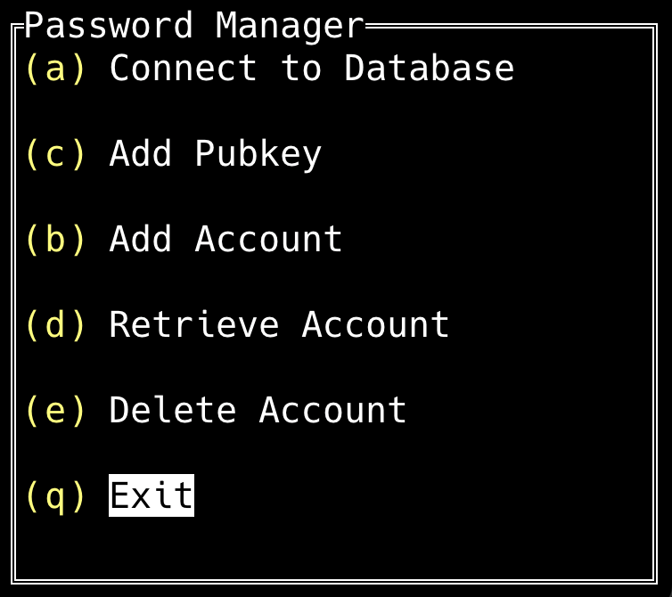

# Yubikey Password Manager

The YK Password Manager uses the GPG encryption key on the YK to encrypt passwords 
and store them in a Postgres database.

  

# Table of Content
1. [Features](#features)
2. [Requirements](#requirements)
3. [Build Instructions](#buildInstructions)
4. [Deploy Instructions](#deployInstructions)
5. [Pending Features](#pendingFeatures)
6. [Security Considerations](#securityConsiderations)

## Features

  - Connect to PG Database (SSL Supported)
  - Add Public Key
  - Add Account
  - Retrieve Password
  - Delete Account

## Requirements

  - Yubikey
  - Public Key (Armored) 
  - Private Key loaded into the Yubikey (Encryption Key)
  - GPG installed on host (OpenGPG)
  - Postgresql Database

## Build Instructions

  User must modify the following:
  
  - Build Platform (Backend Dockerfile) 
  - SSL server cert and key (pg configuration files)
  - (Optional) Update postgresql.conf

  Build using the following command:

        docker-compose -f ./build/docker-compose.yml build --no-cache

  ### Backend

        docker run ykpm-backend:latest > ykpm.exe

  ### PG

  Tag it and push it to a repo, or save it and load it on target machine.
  **Note: User can modify the container names in the docker-compose files
  to skip the tag process**
        

## Deploy Instructions
  
  ### Kubernetes

  User must modify the following:
  
  - Kubernetes Deployment (deployment.yaml):
    - External IPs
    - Image

          kubectl apply -f deployment.yaml

  - Kubernetes Secret (secret.yaml):
    - Postgresql User Password

          kubectl apply -f secret.yaml
  - Kubernetes PVC (pvc.yaml)
    - Storage Class

          kubectl apply -f pvc.yaml

  **Notes: Please reference Kubernetes manual for other methods of persistent storage.**

  ### Docker-Compose (LOCAL)

  - cd into the deploy directory
  - Update data directory and pg password

        docker-compose up 

## Pending Features

  - Migrating from decrypting passwords using gpg in the terminal to using the GO's gpg library.
  - Support YK PIV
  - Creating configmap for certificates and postgresql configuration file
  - Improve UI
  - Develop optional Frontend Application in addition to the TUI

## Security Considerations

- While SSL is optional, it is highly recommended.
- Protect passwords and certificate keys. 
- Use firewalls, and the postgresql configuration file to limit access.
